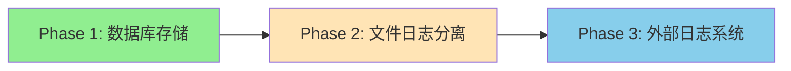

# Cyber Range 日志系统规划

## 总体思路

采用**渐进式架构**：从简单方案起步，保持接口抽象，便于后续无缝升级。



---

## Phase 1：数据库存储（当前推荐）

**适用阶段**：日活 < 1000，日志量 < 10万条/天

### 架构

```
┌─────────────┐     ┌──────────────┐     ┌─────────────┐
│  Gin 中间件  │ ──▶ │  日志服务层   │ ──▶ │   MySQL     │
│  (异步写入)  │     │ (LogService) │     │ (api_logs)  │
└─────────────┘     └──────────────┘     └─────────────┘
                            │
                            ▼
                    ┌──────────────┐
                    │  后台 API    │
                    │ /admin/logs  │
                    └──────────────┘
```

### 优点
- 开发简单，与现有后台无缝集成
- 原生支持 SQL 查询筛选
- 无需额外基础设施

### 缺点
- 高并发下可能成为瓶颈
- 日志量大时查询变慢

### 关键设计

1. **异步写入**：使用 Go Channel 缓冲，批量插入
2. **定时清理**：保留 7-30 天，超期自动删除
3. **索引优化**：`created_at`, `status`, `path` 建索引

### 数据模型

| 字段 | 类型 | 说明 |
| :--- | :--- | :--- |
| id | VARCHAR(36) | 主键 |
| trace_id | VARCHAR(36) | 链路追踪 ID |
| method | VARCHAR(10) | HTTP 方法 |
| path | VARCHAR(500) | 请求路径 |
| status | INT | 响应状态码 |
| latency_ms | INT | 响应延迟 |
| ip | VARCHAR(50) | 客户端 IP |
| user_id | VARCHAR(36) | 登录用户（可选） |
| error | TEXT | 错误信息 |
| created_at | DATETIME | 创建时间 |

---

## Phase 2：文件日志分离

**触发条件**：日志量 > 10万/天，或需要长期归档

### 架构调整

```
┌─────────────┐     ┌──────────────┐     ┌─────────────┐
│  Gin 中间件  │ ──▶ │  日志服务层   │ ──▶ │   MySQL     │ ◀── 热数据 (7天)
│             │     │              │     └─────────────┘
└─────────────┘     │              │
                    │              │ ──▶ ┌─────────────┐
                    └──────────────┘     │  JSON Files │ ◀── 冷数据归档
                                         │ (按日轮转)   │
                                         └─────────────┘
```

### 变更点

1. **双写策略**：
   - 热数据（7天内）写入 MySQL，支持实时查询
   - 冷数据归档到 JSON 文件，按日轮转

2. **日志文件格式**：
   ```
   /var/log/cyber-range/
   ├── api-2026-02-06.json
   ├── api-2026-02-05.json
   └── api-2026-02-04.json.gz  # 压缩归档
   ```

3. **后台查询**：
   - 近 7 天：查 MySQL
   - 历史数据：扫描日志文件

### 迁移成本

**低**：仅需修改 `LogService` 内部实现，无需改动中间件和 API

---

## Phase 3：外部日志系统

**触发条件**：日志量 > 100万/天，或需要高级分析/告警

### 推荐选型

| 方案 | 适用场景 | 复杂度 |
| :--- | :--- | :--- |
| **Loki + Grafana** | 轻量级、K8s 友好 | ⭐⭐ |
| **ELK Stack** | 全文检索、复杂分析 | ⭐⭐⭐⭐ |
| **ClickHouse** | 超大规模、实时分析 | ⭐⭐⭐ |

### 推荐：Loki + Grafana

```
┌─────────────┐     ┌──────────────┐     ┌─────────────┐
│  Gin 中间件  │ ──▶ │   Promtail   │ ──▶ │    Loki     │
│  (JSON Log) │     │  (收集器)     │     │  (存储)     │
└─────────────┘     └──────────────┘     └─────────────┘
                                               │
                                               ▼
                                         ┌─────────────┐
                                         │   Grafana   │
                                         │  (可视化)    │
                                         └─────────────┘
```

### 优势
- 原生支持 Grafana 可视化
- 成本低（不需要 ES 那样的资源）
- 支持 LogQL 查询语言
- 告警规则配置

### 迁移成本

**中等**：
- 需部署 Loki + Grafana（Docker Compose 即可）
- 修改日志输出格式为 JSON
- 后台 Logs 页面可选保留/移除

---

## 抽象层设计（关键）

为了支持平滑迁移，从 Phase 1 开始就应设计日志抽象层：

```go
// pkg/logstore/interface.go
type LogStore interface {
    Store(ctx context.Context, log *APILog) error
    Query(ctx context.Context, filter Filter, page Pagination) ([]APILog, int64, error)
    GetByTraceID(ctx context.Context, traceID string) (*APILog, error)
    Cleanup(ctx context.Context, olderThan time.Duration) (int64, error)
}

// 实现
type MySQLLogStore struct { ... }   // Phase 1
type FileLogStore struct { ... }    // Phase 2 (归档)
type LokiLogStore struct { ... }    // Phase 3
```

> [!TIP]
> 只要保持 `LogStore` 接口不变，后续迁移只需切换实现，无需修改业务代码。

---

## 实施建议

| 阶段 | 时机 | 工作量 | 优先级 |
| :--- | :--- | :--- | :--- |
| Phase 1 | 立即 | 2-3 天 | 🔴 高 |
| Phase 2 | 日志量超过阈值 | 1-2 天 | 🟡 中 |
| Phase 3 | 需要高级分析/告警 | 3-5 天 | 🟢 低 |

---

## 下一步

确认 Phase 1 方案后，我可以制定详细的实施计划，包括：
1. 数据库迁移脚本
2. LogService 实现
3. 中间件改造
4. 后台 API 和前端页面
